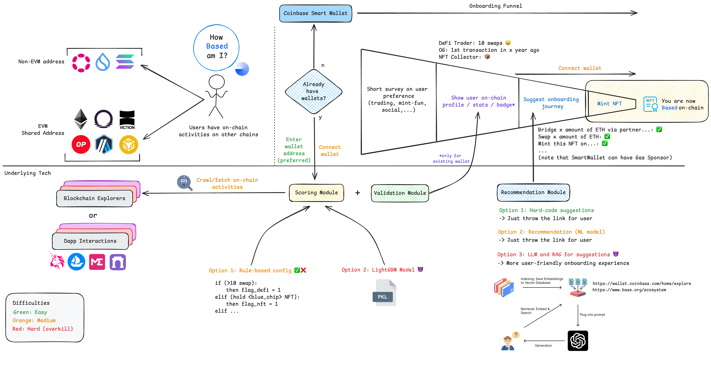
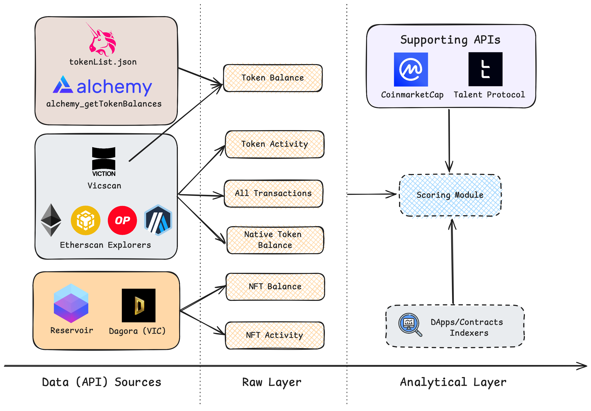
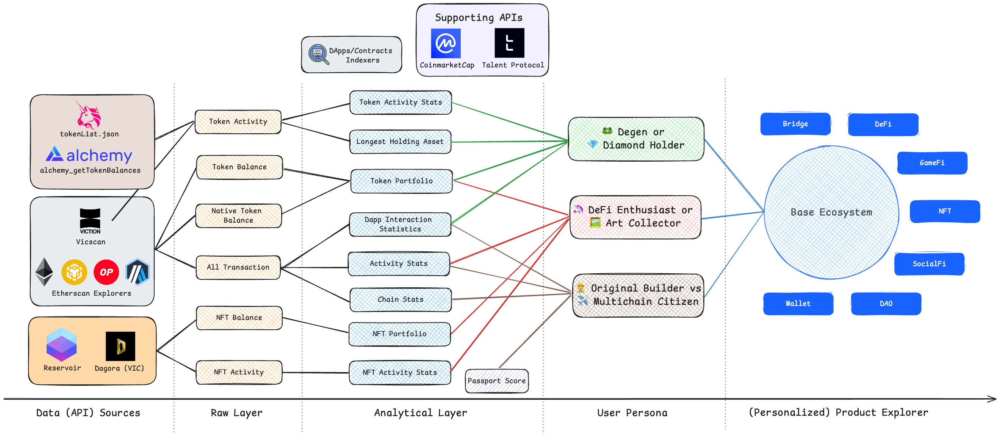

# Buildathon DEVLOG

This DEVLOG includes the initial development process of this project during [Based SEA Buildathon ](https://based-sea.devfolio.co/) participation.

---

## 2024-10-07

Idea initiation - multichain-scoring for personalized recommendations of product for user to have more motivation onboarding to Base

- Extension of [onchainscore.xyz](https://www.onchainscore.xyz/) and [Basename on-chain score](https://x.com/base/status/1841911856656708073), multi-aggregation, product-oriented (DeFi, GameFi, NFT, SocialFi,...) metrics

Whiteboard: [Excalidraw](https://excalidraw.com/#room=4d025e9394a150d042b9,SLby7Ri-UjHaGsRpWElsjQ)

Technical preparation:

- evm-scan data fetching ([Etherscan](https://etherscan.io/) and its sub-products on multichains): From ETH, Base, OP, BSC, ARB -> Setup API key and router
- Token & NFT Activity: [Alchemy](https://www.alchemy.com/) and [Reservoir](https://reservoir.tools/)
- Vietnamese-oriented chain: [Viction](https://www.viction.xyz/) (explorer scan) and [Dagora](https://dagora.xyz/) (NFT marketplace)

Done:

- Init repo with [OnChainKit](onchainkit.xyz)

## 2024-10-08

Done:

- API router for data fetching (simple aggregation)
- Convert [ENS](https://dagora.xyz/) (.eth) and [OneID](https://www.oneid.xyz/) to wallet address

Define scoring metrics and UI/UX (expected insights for user)

Data collection & Resources:

- Token metadata list: [Coin98 Token List](https://rapid.coin98.com/token-list.json)
- Native Basename on-chain Stats: [Basenames/UsernameProfileSectionHeatmap](https://github.com/base-org/web/tree/master/apps/web/src/components/Basenames/UsernameProfileSectionHeatmap)

## 2024-10-10

- Fully integrate the API data sources (figure below). New sources:
  - Talent Protocol: [Passport Credentials](https://docs.talentprotocol.com/docs/talent-passport/credentials) for pre-score insights.
  - CoinmarketCap: Quotes API for latest price and tags [getV2CryptocurrencyQuotesLatest](https://coinmarketcap.com/api/documentation/v1/#operation/getV2CryptocurrencyQuotesLatest)
  - Uniswap Labs: [List Tokens](https://tokenlists.org/token-list?url=https://ipfs.io/ipns/tokens.uniswap.org) (replace previous Coin98 source)
- (Raw) union sources between native EVM and Viction. Collected data:
  - Tokens (ERC/BEP/VRC-20 and 721):
    - Activity (from/to transactions)
    - Token balance (at call time)
    - Native token (ETH, BNB, VIC) balance
  - Transactions: all raw from explorers
  - NFT:
    - Balance: collections holding at call time
    - Activity: List/Sale/Bid/Mint/Buy history
- CoinmarketCap API will be use to convert token/NFT value to one currency (USD/ETH) to perform metric calculations.

Data support summary

| **Sections**         | **Ethereum** | **Base** | **Optimism** | **Arbitrum** | **Viction** | **BSC** |
| -------------------- | :----------: | :------: | :----------: | :----------: | :---------: | :-----: |
| All Transactions     |      ✅      |    ✅    |      ✅      |      ✅      |     ✅      |   ✅    |
| Native Token Balance |      ✅      |    ✅    |      ✅      |      ✅      |     ✅      |   ✅    |
| Token Activity       |      ✅      |    ✅    |      ✅      |      ✅      |     ✅      |   ✅    |
| Token Balance        |      ✅      |    ✅    |      ✅      |      ✅      |     ✅      |   ❌    |
| NFT Activity         |      ✅      |    ✅    |      ✅      |      ✅      |     ✅      |   ✅    |
| NFT Balance          |      ✅      |    ✅    |      ✅      |      ✅      |     ✅      |   ✅    |

## 2024-10-11

- Aggregate/Unify Transactions, Token Balance, NFT Balance types (see TEVMTransction, TTokenBalance, TNFTBalance)
- Remove BSC data source since it didn't have Token Balance API
- Compute metric/insight + start polish UI (Multi-chain heatmap, Multi-chain portfolio)

## 2024-10-13

- Finalized all logical components
- UI Polishment
- You are ready to get Based!
  

## 2024-10-15

- Switch Dagora to client-side API service (instead of server-side) to avoid breaking on production (Dagora might have whitelisted server)
- Display Based Picks card and revamp UI (reuse a few components from base-org web)
- Filter Spam NFT for UI display and scoring calculation
- Fix NFT Activity loading for too long
  - Migrate back to raw explorer's transactions and identify mint-buy-sale activity, rather than relying on Reservoir NFT Activity API
  - Drawback: Cannot capture Listing/Bidding activities
- Scoring recalculation after testing on 10-20 known wallets (and polish for better UI displayment)

## 2024-10-17

- Implement NFT minting flow with Coinbase CDP-SDK (thanks to the latest Instamint demo).
  - Use Pinata for actual metadata IPFS storage
  - Deploy custom ERC721 contract (since CDP native 721 contract not support incremental tokenID and dynamic metadata)
- Fix getAddress (from ENS) rate limit error when hitting cloudflare-eth
